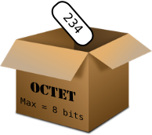
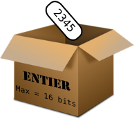
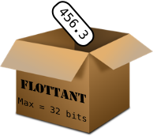
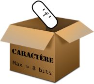
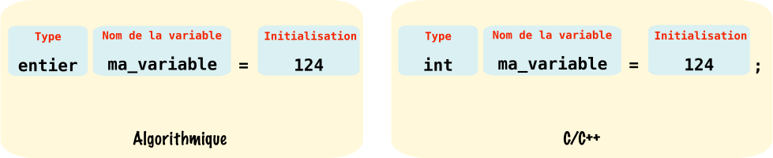

# Les variables et constantes dans un code Arduino

La variable est en programmation un système de stockage de données. Par analogie une variable peut être comparée à une boîte, le type de variable correspondant à la taille de la boîte, plus le type est codé sur un nombre de bits important, plus la boîte sera grande. L'intérieur d'une variable contient un nombre (ou un caractère si le type le permet) modifiable à souhait tout au long du programme.


## 1. Les types de variables

### 1.1 Signé ou non Signé ??

Vous avez peut-être pu remarquer au cours de vos lectures la référence à un type de variable signé ou non signé, qu'est ce que ça peut bien vouloir dire ?
La "signature" est un moyen en programmation pour coder les nombres relatifs, un type de variable non signé comme par exemple un ```unsigned int``` ne pourra pas contenir un nombre relatif inférieur à 0 comme -9. À contrario, un type signé comme ```int``` pourra contenir un nombre relatif supérieur ou inférieur à 0.

### 1.2 Le booléen : ```boolean```


Le booléen noté ```boolean``` sur Arduino, est le plus petit type de variable que vous serez emmené à rencontrer, il est codé sur seulement 2 bits. Son contenu ne peut être que **0 ou 1**, soit ```True```ou ```False```sur Arduino.
Ce type est souvent utilisé pour stocker l'état d'un capteur numérique, par exemple un bouton poussoir : ```True```si le bouton est appuyé, ```False```si il est relâché. C'est un type non signé.

### 1.3 L'octet : ```byte```



L'octet noté ```byte``` sous Arduino, est un type de variable codé sur 8 bits. Son contenu est un nombre pouvant aller de **0 à 255**. C'est un type non signé.

### 1.4 L'entier : ```int```



L'entier noté ```int``` sous Arduino, est un type de variable **signé** codé sur 16 bits. Son contenu est un nombre pouvant aller de ${-2}^{15}$ à ${2}^{15}-1$ soit de -32768 à 32767. Le calcul des extrema se fait sur 15 bits et non pas sur 16 car le bit de poids fort est réservé pour le bit de signe, si celui-ci est à 1 le complément à deux du nombre qui suit est interprété comme un négatif, inversement pour un positif.

!!! info
    Il existe le type ```unsigned int``` pour un entier non signé. Les valeurs limites sont donc de 0 à $2^{16}-1$, soit de 0 à  65 535.

### 1.5 Le flottant : ```float```



Le flottant noté ```float``` sous Arduino, est un type de variable **signé** codé sur 4 octets soit 32 bits. Son contenu est un nombre pouvant aller de 3.4028235E+38 à -3.4028235E+38.

**Codage d'un nombre en virgule flottante :**
La virgule flottante est une technique pour stocker dans une variable un nombre réel. Pour cela il suffit de décomposer le nombre de la manière suivante :


* Le bit de poids fort est le bit de signe, il est à 1 si le nombre est négatif, à 0 si il est positif.
* La mantisse contient les chiffres significatifs du nombre elle est codée sur 23 bits.
* L'exposant représente la place de la virgule dans le nombre, il est codé sur 8 bits.
 
### 1.6 Le caractère : ```char```



Le caractère noté ```char``` sous Arduino, est un type de variable codé sur 8 bits. Son contenu est un **caractère**, codé avec son code décimal ASCII correspondant. Pour enregistrer un caractère il suffit de le mettre entre côtes : ```'a'``` , si on souhaite enregistrer le code **décimal** ASCII correspondant au caractère souhaité il suffit de le noter tel quel. Pour ```'a'``` le code ASCII correspondant est 97.

**Le codage ASCII**

L'ASCII pour *American Standard Code for Information Interchange* (Code américain normalisé pour l'échange d'information) est un système de codage des caractères inventé dans les 60 par l'ISO (*International Organization for Standardization*). C'est un système de codage devenu un standard pour transmettre l'information de manière numérique. Pour de plus amples renseignements sur la création du code ASCII n'hésitez pas à consulter la page [Wikipédia](https://fr.wikipedia.org/wiki/American_Standard_Code_for_Information_Interchange) dédiée.


## 2. La déclaration et l'initialisation de variables

Pour utiliser une variable dans son programme Arduino il faut au préalable la créer, en programmation on parlera de **déclarer une variable**. Le langage C/C++ autorise la déclaration de variables n'importe où dans le code, cependant il est préférable pour les novices de **faire toutes les déclarations et initialisations au début**, juste après les ajouts de bibliothèques (```#define ...```). Quand on déclare une variable on a pour obligation de lui donner un nom, et de préciser son type, il est préférable également de l'initialiser, c'est à dire lui donner une valeur de départ sans quoi un nombre indépendant de notre volonté sera enregistré.

Pour déclarer et initialiser une variable il suffit d'utiliser l'instruction suivante :



Dans cet exemple nous venons de déclarer une variable de type entier appelée *ma_variable* et initialisée à 124.

!!! warning
    Les noms de variables ne doivent **pas contenir d'espaces, d'accents, de caractères spéciaux autre que ```_```**. De plus le langage C/C++ est **sensible à la casse** c'est à dire qu'il différencie les minuscules des majuscules.

**Autres exemples :**

* Pour un booléen : ```boolean etat_bp=true;``` Initialisation d'un booléen appelé etat_bp à l'état haut.
* Pour un flottant : ```float capteur=56.4;``` Initialisation d'un flottant appelé capteur à la valeur 56.4.
* Pour un octet : ```byte toto=23;``` Initialisation d'un octet appelé toto à la valeur 23.
* Pour un caractère : ```char mon_caractere='b';``` ou ```char mon_caractere=98;``` Initialisation d'un caractère appelé mon_caractere à la valeur 98 code ASCII correspondant à 'b'.


## 3. La déclaration de constantes

Une constante à l'inverse d'une variable, ne varie pas lors de l'exécution du programme elle reste à la valeur à laquelle elle a été initialisée. Cela est très utile pour **définir un numéro de pin ou une constante comme le nombre pi.** Nous développons ci-dessous 2 méthodes pour déclarer une constante :

### 3.1 Utilisation de ```const```

La définition d'une constante grâce au mot clé ```const``` est la méthode à privilégier, il suffit pour cela de choisir le bon type de variable pouvant contenir notre constante et utiliser l'instruction suivante :


Ici nous déclarons une constante appelée ```ma_constante``` et initialisée à la valeur 234.

### 3.2 Utilisation de ```#define```

La définition d'une constante à l'aide du mot clé ```#define``` est **à éviter**, toutefois nous tenons à vous montrer son utilisation ci-dessous :


!!! warning
    Le ```#define``` attribue dans l'exemple ci-dessus le mot ```ma_constante``` à ```234``` avant la compilation. C'est à dire que dans tout le code à chaque fois que le mot ```ma_constante``` sera utilisé il sera remplacé par ```234```, je vous laisse voir les problèmes que cela peut poser dans le code...
