# Les fonctions Arduino

## Lire et écrire sur les pins numériques

Les cartes Arduino disposent toutes de pins numériques utilisables aussi bien en entrées qu'en sorties, nous montrons dans ce cours comment les paramétrer et s'en servir.

Nous rappelons ci-dessous l'emplacement des pins numériques sur une carte Arduino UNO et MEGA :


### 1. Paramétrage du sens d'utilisation avec ```pinMode()```
Une carte Arduino peu importe le modèle, dispose de pins numériques et de pins analogiques, la première catégorie de pins contrairement à la seconde peut être configurée, aussi bien en entrée qu'en sortie :

* Une pin numérique est utilisée en **entrée** ```INPUT``` pour recueillir une information extérieure (un "1" ou un "0") venant d'un capteur à sortie numérique, par exemple un bouton poussoir ou un capteur ILS (Reed).

* Une pin numérique est utilisée en **sortie** ```OUTPUT``` pour écrire un niveau logique (un "1" ou un "0") sur l'entrée d'un actionneur, par exemple une led, un relais ou un moteur.

La figure ci-dessous illustre ces deux possibilités, **la pin 13 est configurée en sortie et la pin 2 en entrée** :


La fonction ```pinMode()``` à coder dans la partie ```void setup()``` va nous permettre d'indiquer au micro-contrôleur le sens d'utilisation de chaque pin. Ci-dessous nous donnons la structure de cette fonction :

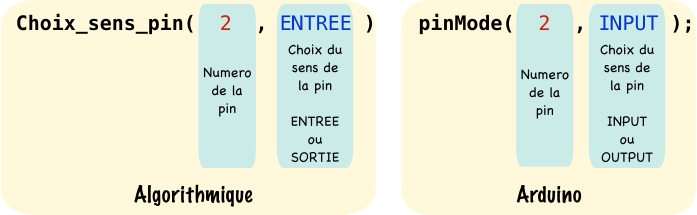

Puis un code exemple de l'utilisation de cette fonction :

```c++
const int led=13; //Déclaration d'une constante de type entier appelée "led" et initialisée à 13
const int bp=2; //Déclaration d'une constante de type entier appelée "bp" et initialisée à 2

void setup() //Initialisations
{
	pinMode(led,OUTPUT); //Mise en sortie de la pin 13
	pinMode(bp,INPUT); //Mise en entrée de la pin 2
}

```

!!! warning
    Comme précisé ci-dessus ```pinMode()``` ne s'utilise qu'avec des **pins numériques (digital)**. De plus quand une pin a été définie en sortie, il est interdit de l'utiliser en entrée plus tard dans le programme et vice-versa.

### 2. Utilisation de ```digitalWrite()```
La fonction Arduino ```digitalWrite()``` permet d'écrire une information numérique (un 0 ou un 1), sur une **pin numérique**. Les niveaux de tension correspondants sont les niveaux TTL :

* Un **1** logique vaut **5V**
* Un **0** logique vaut **GND** (la masse)

Ci-dessous nous donnons la structure de cette fonction :

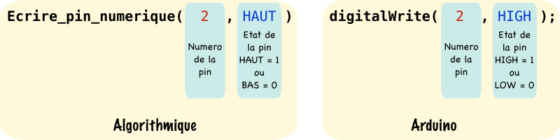

Le code ci-dessous allume la led 13 reliée à la pin 13 (led présente sur le circuit imprimé d'une carte Arduino UNO ou Mega) en se servant de ```digitalWrite()``` :

```c++
const int led=13; //Déclaration d'une constante de type int et de nom "led", contenant 13 la pin où la led est reliée

void setup() //Initialisations
{
	pinMode(led,OUTPUT); //Mise en sortie de la pin numérique 13
}

void loop() //Programme principal
{
	digitalWrite(led,HIGH); //Mise à 1 de la pin numérique 13 désignée par la constante led
}

```

Même exemple mais en se servant d'une variable ```etat``` de type ```boolean``` contenant le niveau logique servant à l'allumage de la led :

```c++
const int led=13; //Déclaration d'une constante de type int et de nom "led", contenant 13 la pin où la led est reliée
boolean etat=true; //Déclaration d'une variable "etat" de type booléen initialisée à true (soit niveau logique 1)

void setup() //Initialisation
{
	pinMode(led,OUTPUT); //Mise en sortie de la pin numérique 13
}

void loop() //Programme principal
{
	digitalWrite(led,etat); //Mise à 1 de la pin numérique 13 désignée par la constante led, l'état de la pin est contenu dans la variable "etat"
}

```

Emplacement de la led 13 sur les cartes Arduino UNO et MEGA :


### 3. Utilisation de ```digitalRead()```
La fonction Arduino ```digitalRead()``` permet de lire une information numérique (un 0 ou un 1), sur une **pin numérique**. Les niveaux de tension correspondants sont également des niveaux TTL.

Ci-dessous nous donnons la structure de cette fonction :




Le code ci-dessous allume la led reliée à la pin 13 quand le bouton poussoir reliée à la pin 2 est appuyé :

```c++
const int led=13; //Déclaration d'une constante de type int et de nom "led", contenant 13 la pin où la led est reliée
const int bp=2; //Déclaration d'une constante de type int et de nom "bp", contenant 2 la pin où le bouton poussoir est relié
boolean etat=false; //Déclaration d'une variable "etat" de type booléen initialisée à false (soit niveau logique 0)

void setup() //Initialisation
{
	pinMode(led,OUTPUT); //Mise en sortie de la pin numérique 13 pour la led
	pinMode(bp,INPUT); //Mise en entrée de la pin numérique 2 pour le bouton poussoir
}

void loop() //Programme principal
{
	etat=digitalRead(bp); //Lecture de la valeur de la pin 2 : bouton appuyé -> etat=1   bouton relaché -> etat=0
	digitalWrite(led,etat); //La led s'allume ou s'éteint suivant la valeur de "etat"
}

```

Montage Arduino pour le code précédent :


## Utiliser le CAN et le PWM

L'environnement Arduino nous permet d'utiliser de manière simple deux fonctions essentielles d'un microcontrôleur le CAN et le PWM, nous donnons dans ce cours les explications quant à leurs paramétrages et leurs utilisations.

### 1. Fonctionnement du CAN et utilisation de ```analogRead()```

Nous rappelons ci-dessous l'emplacement des pins analogiques sur une carte Arduino UNO et MEGA :

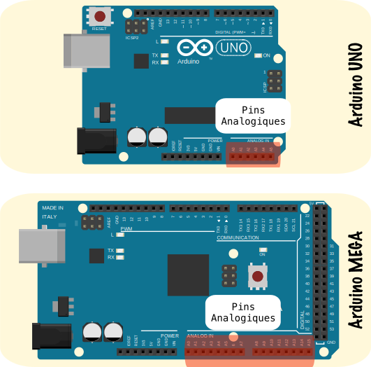

#### 1.1 Apport théorique sur la conversion analogique numérique
Les cartes Arduino UNO et MEGA disposent toutes deux d'un Convertisseur Analogique Numérique de 10 bits intégré au micro-contrôleur, la figure ci-dessous vise à expliquer son fonctionnement :

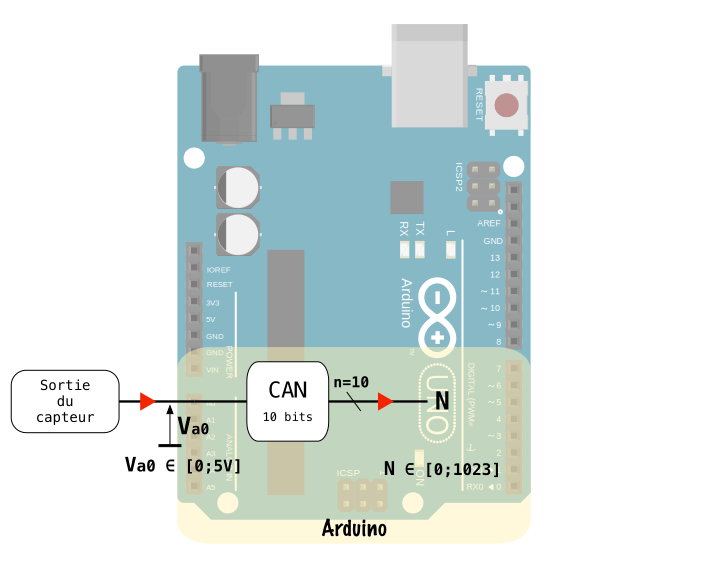

Une carte Arduino dispose de 6 entrées analogiques A0 à A5 pour le UNO, 16 de A0 à A15 pour le MEGA. L'entrée du convertisseur $$V_{a0}$$ accepte une **tension analogiques comprise entre 0 et 5V maximum, qui sera convertie en un nombre binaire N compris entre 0 et 1023**.

Nous déduisons alors la caractéristique entrée/sortie du CAN :

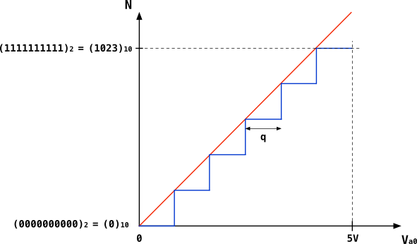

Le quantum q est la plage de tension analogique qui permet à la sortie N de croître d'une marche quand celle-ci est dépassée :

$$
q=\frac{V_{pe}}{2^{n}-1}=\frac{5}{2^{10}-1}=4.89mV
$$

À partir de la droite rouge nous obtenons l'équation du CAN :

$$
(N)_{10}=\frac{1023}{5}\times V_{a0}
$$

On peut alors en déduire les valeurs $N_{min}$ et $N_{max}$ :

$$
N_{min}=(0000000000)_{2}=(0)_{10}
$$

$$
N_{max}=2^{10}-1=(1111111111)_{2}=(1023)_{10}
$$


#### 1.2 Utiliser le CAN avec Arduino

L'utilisation du CAN avec Arduino est très simple, il suffit d'utiliser la fonction ```analogRead()```, nous donnons ci-dessous sa structure :


Le code suivant lit la valeur analogique sur la pin A0 et la convertit en ```N``` en utilisant la fonction ```analogRead```. La variable ```N``` est ensuite convertie en Volts grâce à l'équation de la droite du CAN, pour obtenir finalement la variable ```Va0```.

```c++
const int PinAna=0; //Déclaration d'une constante de type int et de nom "PinAna", contenant 0 la pin analogique à lire
float VaO=0; //Déclaration d'une variable de type float et de nom "Vao", initialisée à 0
int N=0; //Déclaration d'une variable de type int et de nom "N", initialisée à 0

void setup() //Initialisation
{
//Pas de pinMode pour analogRead()
}

void loop() //Programme principal
{
	N=analogRead(PinAna); //Lecture de la valeur Va0 de la pin analogique 0 et conversion en N -> 0<N<1023
	Vao=(5.0/1023.0)* N; //Conversion de N en Va0 grâce à l'équation de la droite du CAN
}
```

!!! warning
    Ne pas déclarer la pin analogique utilisée en entrée à l'aide de ```pinMode()``` Arduino le fait de manière automatique sachant que ```analogRead()``` ne s'utilise qu'avec des pins analogiques **qui ne fonctionnent qu'en entrée**.

### 2. Fonctionnement du PWM et utilisation de ```analogWrite()```

#### 2.1 Apport théorique sur la modulation de largeur d'impulsion (MLI)

La MLI aussi appelée PWM (Pulse Width Modulation) en Anglais, est une technique permettant de faire varier la valeur moyenne de la tension d'un signal carré en changeant son rapport cyclique. Avant de rentrer dans les détails, revoyons un peu de vocabulaire technique.


La figure ci-dessus montre un signal carré configuré de cette manière :

* Période : T = 2ms

* Fréquence : f = $\frac{1}{T}$ = 500Hz

* Durée de l'état bas : $T_b$ = 1ms

* Durée de l'état haut : $T_h$ = 1ms

* Tension max : $V_{max}$ = $\hat{V}$ = 5V

* Tension min : $V_{min}$ = 0V

Nous montrons ici comment calculer sa valeur moyenne :


Formule de la valeur moyenne $<V>$ pour un signal carré et **seulement pour un signal carré** :

$$
<V>=\frac{\Delta T}{T}
$$

Où $\Delta T$ est l'aire du carré bleu :

$$
\Delta T =V_{max}\times T_h
$$

Nous obtenons alors :

$$
<V>=\frac{V_{max}\times T_h}{T}
$$

En faisant l'application numérique à la figure ci-dessus :

$$
<V>=\frac{5\times 1\times 10^{-3}}{2\times 10^{-3}}=2,5V
$$

On trace à présent la valeur moyenne $<V>$ en vert sur la figure :


Introduisons à présent la notion de **rapport cyclique** $\alpha$ qui est essentielle à la compréhension du fonctionnement d'un PWM :

$$
\alpha=\frac{T_h}{T}
$$

Le rapport cyclique est un pourcentage : $0\%<\alpha<100\%$

**La technique du PWM consiste à faire varier le rapport cyclique qui revient à faire varier la valeur moyenne du signal**.
Nous donnons ci-dessous des variations du rapport cyclique du signal carré précédent, **tout en gardant la même fréquence** f=500Hz :

* Pour $\alpha=0\%$


* Pour $\alpha=10\%$

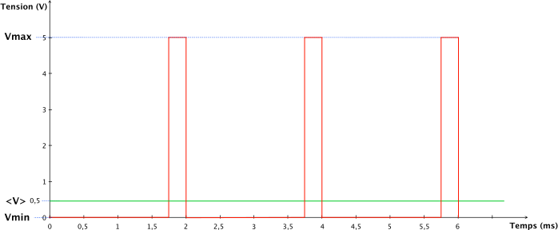

* Pour $\alpha=50\%$

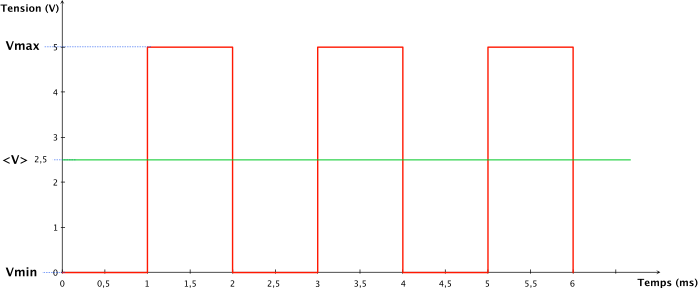

* Pour $\alpha=90\%$

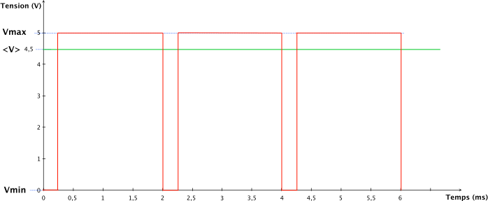

* Pour $\alpha=100\%$


Avec une fréquence élevée le composant branché en sortie du PWM **ne verra que la valeur moyenne (la droite verte) du signal carré qui est continue**.

La technique du PWM peut être utilisée dans les cas suivants :

* Faire varier la vitesse d'un moteur à courant continu.
* Faire varier la luminosité d'une led.

#### 2.2 Utiliser le PWM avec Arduino

En environnement Arduino, le PWM s'utilise avec la fonction ```analogWrite()```, nous donnons ci-dessous sa structure :

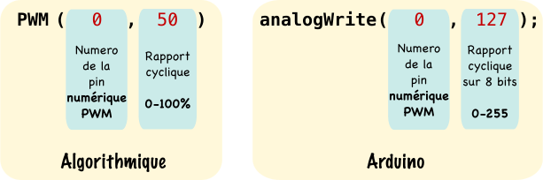

Le choix du rapport cyclique avec la fonction ```analogWrite()``` se fait sur **8 bits** soit une valeur comprise entre 0 -> 0% et 255 -> 100%

**Le PWM ne s'utilise pas avec n'importe quelle pin ! Il faut que la pin soit numérique et que ce soit une pin PWM**, nous donnons le numéro des pins utilisables avec les cartes Arduino UNO et MEGA ainsi que la fréquence dans le tableau suivant :

Carte  | Pins PWM	|	Fréquence du PWM
------------- | ------------- | -------------
UNO  | 3,5,6,9,10,11 | 490Hz et 980Hz sur pins 3 et 11
MEGA  | 2 à 13, 44 à 46 | 490Hz et 980Hz sur pins 3 et 11

!!! note
    Les pins numériques utilisables en PWM sont notées avec un **~** sur les cartes Arduino.

Nous donnons ci-dessous un code exemple de l'utilisation de cette fonction :

```c++
const int PinPWM=3; //Déclaration d'une constante de type int et de nom "PinPWM", contenant 3 la pin numérique à utiliser pour le pwm

void setup() //Initialisation
{
	pinMode(PinPWM,OUTPUT);//Mise en sortie de la pin numérique 3 pour utiliser le pwm
}

void loop() //Programme principal
{
	analogWrite(PinPWM,127); //Création d'un signal PWM sur la pin numérique 3 avec un rapport cyclique de 50%
}
```

## Le port série

Le port série Serial ou encore UART est un protocole de communication filaire, où les données à transmettre sont envoyées par paquets de 8 bits. Le port série est un des moyens qu'a une carte Arduino pour communiquer avec des éléments externes comme une autre carte ou un ordinateur.

### 1. Fonctionnement de l'UART
L'UART (Universal Asynchronous Receiver Transmitter) est un des périphériques du micro-contrôleur qui vient gérer la liaison série, ce protocole de communication nécessite 3 fils. La figure ci-dessous montre le câblage nécessaire pour une transmission série par l'UART entre 2 cartes Arduino UNO.


Les données transitent par la liaison série sous forme de **paquets de 8bits plus 1 bit de start et 1 bit de stop**, nous donnons ci-dessous une trame, exemple d'émission par l'UART :


Décrivons les étapes de cet envoi qui débute à gauche du graphe et se termine à droite :

1. La liaison est au **repos au niveau "1" à 5V** dans un état que l'on apelle **"Idle"** en Anglais.

2. La liaison détecte le début d'émission par le passage de l'état Idle à "0" => **C'est le bit de start**.

3. Les **8 bits du message** sont envoyés en commençant par le bit de poids faible le **LSB** (Least Significant Bit) et se termine par le bit de poids fort le MSB (Most Significant Bit). Si le message que l'on souhaite envoyer est codé sur plus de 8 bits il sera découpé en paquet de 8 obligatoirement.

4. La liaison termine son émission par un **bit de stop à "1"** avant de retourner à l'état Idle.

### 2. Paramétrer l'UART avec ```Serial.begin()```
La fréquence d'émission soit le nombre de **Bauds** (bits par seconde) est définie avec la fonction Arduino ```Serial.begin()```, notons que cette durée ne varie pas dans la suite du code une fois qu'on en a fait le paramétrage dans le ```void setup()```. Nous donnons ci-dessous la structure de cette fonction :


!!! warning
    Le protocole de transmission série étant asynchrone l'horloge qui permet de synchroniser les signaux entre l'émetteur et le récepteur n'est pas transmise. Il faut donc que la **fréquence d'émission soit la même sur l'émetteur et sur le récepteur.**

Nous donnons ci-dessous un code exemple Arduino pour le paramétrage d'une liaison série à 9600 Bauds :

```c++
void setup()//Initialisations
{
  Serial.begin(9600);//Initialisation du port série avec une fréquence d'émission de 9600 Bauds
}
```

### 3. Ecrire sur le port série avec ```Serial.print()``` et ```Serial.println()```

Deux fonctions permettent d'écrire simplement des messages sur le port série d'une carte Arduino :

* ```Serial.print()``` : Permet d'écrire de multiples choses sur le serial sans se soucier si le contenu de notre message est d'une taille supérieure à 8 bits. **La fonction fait elle même le partage en paquets de 8 bits**. Nous donnons ci-dessous la structure de cette fonction :

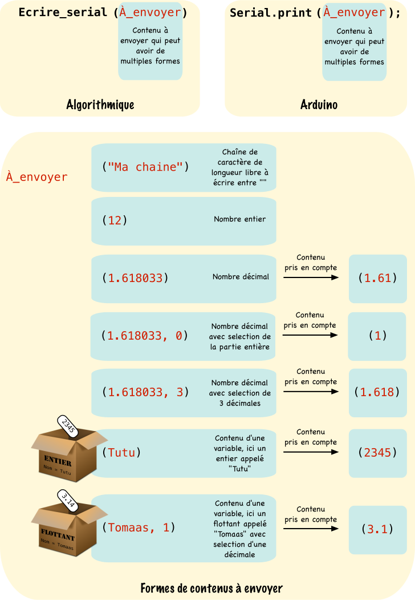

* ```Serial.println()``` : Fait la même chose que la fonction précédente mais provoque un renvoi à la ligne **en fin d'émission**. Nous donnons ci-dessous la structure de cette fonction :


Nous donnons ci-dessous un code exemple complet comprenant l'initialisation du serial et l'utilisation des deux fonctions précédentes :

```c++
int Tutu=2345; //Déclaration d'un entier initialisé à 2345
float Tomaas=3.14;//Déclaration d'un flottant initialisé à 3.14

void setup()//Initialisations
{
  Serial.begin(9600);//Initialisation du port série avec une fréquence d'émission de 9600 Bauds
}

void loop()//Programme principal
{
  Serial.print("Ma variable Tutu contient : ");//Ecriture d'une chaine de caractères sur le serial
  Serial.println(Tutu);//Ecriture du contenu de Tutu et retour à la ligne
  Serial.print("Ma variable Tomaas contient : ");//Ecriture d'une chaine de caractères sur le serial
  Serial.println(Tomaas);//Ecriture du contenu de Tomaas et retour à la ligne
}
```

Une fonction sur l'Arduino IDE appelée **Moniteur série** permet d'afficher ce que notre carte Arduino écrit sur le serial grâce à la liaison usb. (Les pins Rx et Tx du port série sont retransmises sur le port USB). Observons ce que notre code produit sur le moniteur série :

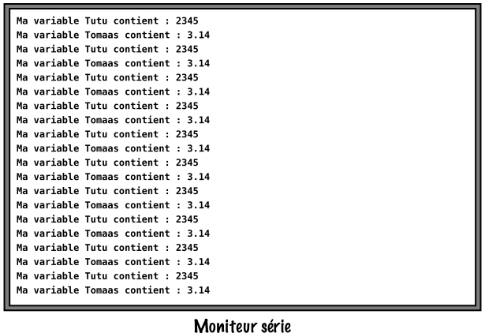

Le code précédent affiche de manière infinie (Nous rappelons que le ```void loop()``` est équivalent à un ```while(1)```) la première chaîne de caractère, le contenu de la variable Tutu, retourne à la ligne puis affiche la seconde chaîne de caractères et affiche la variable Tomaas pour à nouveau retourner à la ligne et recommencer...

## Autres fonctions utiles

Cette partie répertorie toutes les autres fonctions que vous pourriez être amené à utiliser dans vos codes Arduino.

### 1. Faire une pause ```delay()```

La fonction delay permet de mettre en pause l'exécution du programme durant le temps donné **en milli-secondes.** Nous donnons ci-dessous la structure de ce programme :


Nous donnons ci-dessous un code exemple de l'utilisation de cette fonction :

```c++
void loop (void)
{
  //Bloc d'instructions

  delay(5000);//Pause de 5 secondes

  //Bloc d'instructions  
}

```