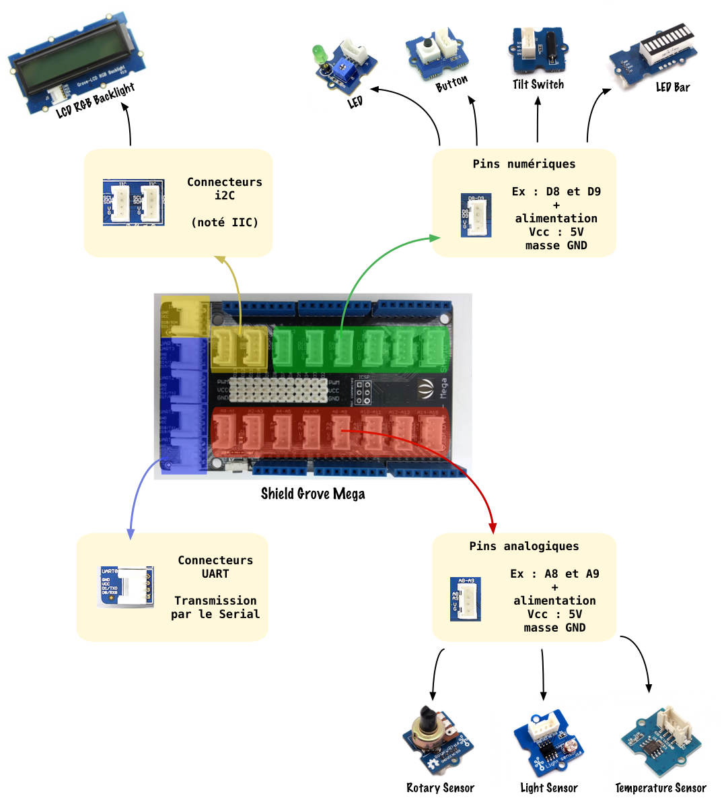
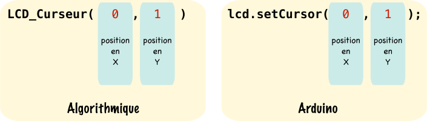
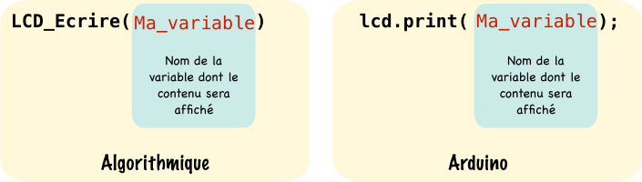
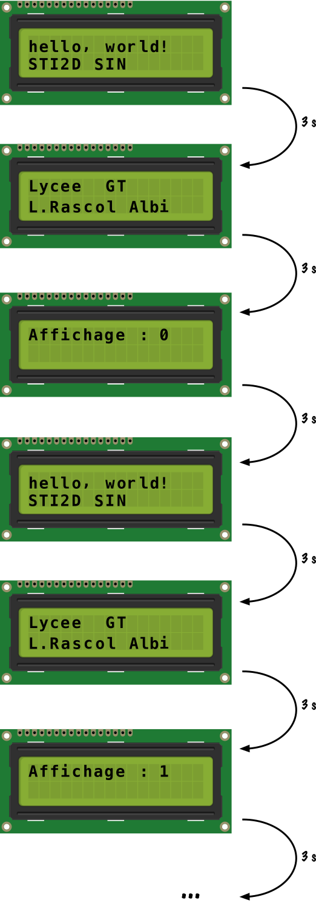

# Utilisation des modules Grove de Seeed Studio

Les modules Grove de Seeed Studio permettant de prototyper rapidement une solution, seront utilisés lors des activités sin.

## 1. Introduction


[Seeed Studio](http://www.seeedstudio.com) est une entreprise Chinoise basée à Shenzhen qui commercialise des produits électroniques pour les [Makers](https://fr.wikipedia.org/wiki/Culture_maker). Grove est un système de modules se branchant sur une carte mère appelée Grove shield :

* Pour Arduino UNO : [Grove Base Shield](http://www.seeedstudio.com/wiki/Grove_-_Base_Shield)
* Pour Arduino Mega : [Grove Mega Shield](http://www.seeedstudio.com/wiki/Grove_-_Mega_Shield)

**Beaucoup de documentation est disponible sur le [Wiki](http://www.seeedstudio.com/wiki/Main_Page) de Seeed Studio allez y jeter un coup d'oeil !**

## 2. Comment connecter un module au shield Grove ?

Ci-dessous le shield Grove Mega qui s'enfiche par dessus une carte Arduino Mega:



Ce shield dispose de 4 familles de connecteurs :

* Les connecteurs sur pins numériques **commençant par un D** qui reçoivent des **modules numériques** comme le module LED, le bouton poussoir (*Button*), le capteur d'inclinaison (*Tilt Switch*) et le bargraphe (*LED Bar*)

* Les connecteurs sur pins analogiques **commençant pas un A** qui reçoivent des **modules analogiques** comme le module potentiomètre (*Rotary Sensor*), le capteur de luminosité (*Light Sensor*) et le capteur de température (*Temperature Sensor*).

* Les connecteurs i2C **IIC sur la carte**, au nombre de 3 (tous les mêmes, spécificité du bus) permettant de connecter par la liaison série i2C des composants fonctionnant sur ce bus comme l'écran LCD (*LCD RGB Backlight*)

* Les connecteurs UART, au nombre de 4 un pour chaque Serial disponible sur l'Arduino MEGA, permettent de connecter des modules utilisant ce type de liaison.

La connexion des modules Grove sur le shield se fait grâce à des **cordons de 4 fils** :

* Un fil **noir pour la masse** noté G ou GND sur les modules
* Un fil **rouge pour l'alimentation** noté Vcc ou V sur les modules
* Un fil **blanc pour un des deux signaux bien souvent ce fil n'est pas utilisé et est noté NC** (Non Connecté)
* Un fil **jaune pour un des deux signaux noté SIG, c'est ce fil qui est utilisé principalement pour connecter le module à la pin désirée**.


Sur ce schéma nous avons connecté le module *Light Sensor* à la pin analogique **A0**.

## 3. Les actionneurs

Les modules actionneurs reçoivent de l'énergie électrique venant de l'Arduino et la transforme, par exemple le module LED reçoit de l'énergie électrique et la transforme en énergie lumineuse.

### 3.1 Le module LED

Nous donnons ci-dessous un exemple d'utilisation du module LED, ce code fait clignoter la LED du module Grove LED toutes les secondes qui est connecté sur la pin numérique 2 :

```c++
const int led=2; //Déclaration d'une constante de type int et de nom "led", contenant 2 la pin où la led est reliée

void setup() //Initialisations
{
	pinMode(led,OUTPUT); //Mise en sortie de la pin numérique 2
}

void loop() //Programme principal
{
	digitalWrite(led,HIGH); //Mise à 1 de la pin numérique 2 désignée par la constante led
	delay(1000); //Pause de 1s
	digitalWrite(led,LOW); //Mise à 0 de la pin numérique 2 désignée par la constante led
	delay(1000); //Pause de 1s
}

```

## 4. Les capteurs

Les modules capteurs émettent un signal électrique (une tension) image de la donnée physique (température, luminosité ...) qu'ils mesurent.

### 4.1 Le module bouton poussoir : *Button*

Nous donnons ci-dessous un code exemple de l'utilisation du module *Button*, le comportement est le suivant : L'appui sur le bouton poussoir relié sur la pin numérique 3, provoque l'allumage de la led reliée sur la pin numérique 2. Le relâchement provoque son extinction.

```c++
const int led=2; //Déclaration d'une constante de type int et de nom "led", contenant 2 la pin où la led est reliée
const int bp=3; //Déclaration d'une constante de type int et de nom "bp", contenant 3 la pin où le bouton poussoir est relié
boolean etat=false; //Déclaration d'une variable "etat" de type booléen initialisée à false (soit niveau logique 0)

void setup() //Initialisation
{
	pinMode(led,OUTPUT); //Mise en sortie de la pin numérique 2 pour la led
	pinMode(bp,INPUT); //Mise en entrée de la pin numérique 3 pour le bouton poussoir
}

void loop() //Programme principal
{
	etat=digitalRead(bp); //Lecture de la valeur de la pin 3 : bouton appuyé -> etat=1   bouton relaché -> etat=0
	digitalWrite(led,etat); //La led s'allume ou s'éteint suivant la valeur de "etat"
}

```

### 4.2 Le module capteur d'inclinaison : *Tilt Switch*

Nous donnons ci-dessous un code exemple de l'utilisation du module *Tilt Switch*, le comportement est le suivant : L'inclinaison du capteur relié sur la pin numérique 3, provoque l'allumage de la led reliée sur la pin numérique 2. Le fait de mettre le capteur à l'horizontale provoque son extinction.

```c++
const int led=2; //Déclaration d'une constante de type int et de nom "led", contenant 2 la pin où la led est reliée
const int tilt=3; //Déclaration d'une constante de type int et de nom "bp", contenant 3 la pin où le bouton poussoir est relié
boolean etat=false; //Déclaration d'une variable "etat" de type booléen initialisée à false (soit niveau logique 0)

void setup() //Initialisation
{
	pinMode(led,OUTPUT); //Mise en sortie de la pin numérique 2 pour la led
	pinMode(tilt,INPUT); //Mise en entrée de la pin numérique 3 pour le tilt switch
}

void loop() //Programme principal
{
	etat=digitalRead(tilt); //Lecture de la valeur de la pin 3 : tilt incliné -> etat=1   tilt horizontal -> etat=0
	digitalWrite(led,etat); //La led s'allume ou s'éteint suivant la valeur de "etat"
}

```

### 4.3 Le module potentiomètre : *Rotary Sensor*

Nous donnons ci-dessous un code exemple de l'utilisation du module *Rotary Sensor*, le comportement est le suivant : Le module potentiomètre est relié à la pin analogique 0, le fait de faire tourner celui-ci fait varier la tension $V_{a0}$ entre 0 et 5V sur cette pin. Nous utilisons le CAN pour lire cette tension et la transformer en une information numérique N comprise entre 0 et 1023 (sur 10 bits), nous "re-bornons" cette information à l'aide de la fonction Arduino ```map()``` entre 0 et 255 (sur 8 bits) et l'utilisons avec le PWM sur la pin numérique 2 pour faire varier la luminosité du module led.

```c++
const int led=2; //Déclaration d'une constante de type int et de nom "led", contenant 2 la pin numérique où la led est reliée
const int rotary_sensor=0; //Déclaration d'une constante de type int et de nom "rotary_sensor", contenant 0 la pin analogique où le potentiomètre est relié

int N=0; //Déclaration d'une variable entière appelée N est initialisée à 0 pour stocker la sortie du CAN

void setup() //Initialisation
{
	pinMode(led,OUTPUT); //Mise en sortie de la pin numérique 2 pour la led
}

void loop() //Programme principal
{
	N=analogRead(rotary_sensor); //Conversion Analogique -> Numérique de la tension Va0 -> N
	N=map(N,0,1023,0,255); //Rebornage de 0<N<1023 en 0<N<255
	analogWrite(led,N); //La luminosité de la led varie en fonction de N et donc de Va0
}

```

### 4.4 Le module LDR : *Light Sensor*

Nous donnons ci-dessous un code exemple de l'utilisation du module *Light Sensor*, le comportement est le suivant : Le module LDR est relié à la pin analogique 0, le fait de faire varier la luminosité (cacher ou dévoiler le capteur) fait varier la tension $V_{a0}$ entre 0 et 5V sur cette pin. Nous utilisons le CAN pour lire cette tension et la transformer en une information numérique N comprise entre 0 et 1023 (sur 10 bits), nous "re-bornons" cette information à l'aide de la fonction Arduino ```map()``` entre 0 et 255 (sur 8 bits) et l'utilisons avec le PWM sur la pin numérique 2 pour faire varier la luminosité du module led. **Cette fois-ci une forte luminosité entraînera une extinction de la led et une faible luminosité un éclairement maximal.**

```c++
const int led=2; //Déclaration d'une constante de type int et de nom "led", contenant 2 la pin numérique où la led est reliée
const int light_sensor=0; //Déclaration d'une constante de type int et de nom "light_sensor", contenant 0 la pin analogique où la LDR est reliée

int N=0; //Déclaration d'une variable entière appelée N est initialisée à 0 pour stocker la sortie du CAN

void setup() //Initialisation
{
	pinMode(led,OUTPUT); //Mise en sortie de la pin numérique 2 pour la led
}

void loop() //Programme principal
{
	N=analogRead(light_sensor); //Conversion Analogique -> Numérique de la tension Va0 -> N
	N=map(N,0,1023,255,0); //Rebornage de 0<N<1023 en 0<N<255 avec inversion pour 0 ->255 pour 1023->0
	analogWrite(led,N); //La luminosité de la led varie en fonction de N et donc de Va0
}

```
!!! info
    Il est possible que la tension de la LDR même avec une forte luminosité ne fasse pas monter la valeur N à 1023, il s'agit donc de regarder la valeur max réelle de N (à l'aide du Serial par exemple) pour ajuster le rebornage dans ```map()```.


### 4.5 Le module température : *Temperature Sensor*

Nous donnons ci-dessous un code exemple de l'utilisation du module *Temperature Sensor*, le comportement est le suivant : Le module température est relié à la pin analogique 0, le fait de faire monter la température au dessus de 30°C allume le module led relié sur la pin numérique 2. Faire descendre la température en dessous provoque l'extinction de la led.

```c++
#include <math.h> //Ajout de la bibliothèque C/C++ math.h pour utiliser la fonction logarithme décimal : log()

//Constantes prises sur la documentation du Wiki de Seeed Studio
const int B=4275; //B valeur de la LDR en Ohms
const int R0 = 100000; //R0 = 100k

const int led=2; //Déclaration d'une constante de type int et de nom "led", contenant 2 la pin numérique où la led est reliée
const int temperature_sensor=0; //Déclaration d'une constante de type int et de nom "temperature_sensor", contenant 0 la pin analogique où le capteur de température est relié

int N=0; //Déclaration d'une variable entière appelée N est initialisée à 0 pour stocker la sortie du CAN
float R=0; //Déclaration d'une variable flottante appelée R est initialisée à 0 pour calculer la température
float temperature=0; //Déclaration d'une variable flottante appelée R est initialisée à 0 pour stocker la valeur de la température

void setup() //Initialisation
{
	pinMode(led,OUTPUT); //Mise en sortie de la pin numérique 2 pour la led
}

void loop() //Programme principal
{
	N=analogRead(temperature_sensor); //Conversion Analogique -> Numérique de la tension Va0 -> N

	//Calcul de la temperature suivant la doc du Wiki de Seeed Studio
	R=1023.0/((float)N)-1.0;
	R=100000.0*R;
 	temperature=1.0/(log(R/100000.0)/B+1/298.15)-273.15; //calcul de la temperature suivant la doc

	if(temperature>30)
	{
		digitalWrite(led,HIGH); //Allumage de la led si temperature > 30
	}
	else
	{
		digitalWrite(led,LOW); //Extinction de la led si temperature < 30
	}
}
```

!!! note
    La bibliothèque math.h est déjà pré-ajoutée dans l'IDE Arduino inutile de chercher où la télécharger.

## 5. L'afficheur LCD

Ce module est un écran LCD noir et blanc de 2 lignes et 16 colonnes, un rétro-éclairage fonctionnant à l'aide de leds RGB est disponible.

!!! info
    Ce module fonctionne grâce à la liaison [i2C](https://fr.wikipedia.org/wiki/I2C), **il est donc nécessaire de choisir un connecteur i2C sur le shield Grove**.

### 5.1 La bibliothèque ```rgb_lcd.h```

**L'ajout d'une bibliothèque à l'IDE Arduino est nécessaire** à l'utilisation du module *LCD RGB Backlight*, celle-ci est disponible sur le Github de Seeed Studio : [lien](https://github.com/Seeed-Studio/Grove_LCD_RGB_Backlight)


Ensuite, ajoutez le fichier .zip à l'IDE Arduino :


Il suffit d'inclure à présent la bibliothèque **au début** du code Arduino de cette manière :

```c++
#include <Wire.h> //Ajout de la bibliothèque i2c pour utiliser le lcd
#include "rgb_lcd.h" //Ajout de la bibliothèque du lcd

```

!!! info
    Ne pas oublier d'ajouter également la bibliothèque ```Wire.h``` pour utiliser la liaison i2C.

### 5.2 Initialisation du lcd avec ```lcd.begin()```

Nous donnons ci-dessous un code exemple de l'initialisation de l'écran *Grove RGB LCD* :

```c++
rgb_lcd lcd; //Constructeur rgb_lcd pour l'objet lcd

void setup() //Initialisations
{
    lcd.begin(16, 2); //Initialisation du lcd de 16 colonnes et 2 lignes
}
```


#### Écrire où l'on veut avec ```lcd.setCursor()```

L'écran lcd du module *Grove RGB LCD* dispose de 16 colonnes et 2 lignes, si on ne précise rien quand on code l'instruction permettant d'écrire des choses dessus, la colonne 0 et la ligne 0 sont prisent en défaut ce qui a pour conséquence d'écrire en haut à gauche :


Mais comment fait-on si on souhaite commencer à écrire au milieu ? Il suffit d'utiliser la fonction ```lcd.setCursor()```, dont nous expliquons le fonctionnement ci-dessous :



### 5.3 Tout effacer avec ```lcd.clear()```

La fonction ```lcd.clear()``` permet d'effacer **entièrement** l'écran lcd, nous donnons la structure de cette fonction ci-dessous :


### 5.4 Écrire avec ```lcd.print()```

La fonction ```lcd.print()``` permet d'écrire ce que l'on veut sur le lcd mais ne **gère pas le dépassement** (écrire au delà des 16 colonnes et 2 lignes), **c'est au développeur de vérifier deux fois que ce qu'il souhaite écrire tienne bien dans la place impartie.** Nous donnons la structure de cette fonction ci-dessous :

* Pour écrire une chaîne de caractères :


* Pour écrire le contenu d'une variable :



Nous donnons ci-dessous un code exemple **complet** de l'utilisation de ```lcd.print()``` et montrons le résultat sur l'écran lcd :

```c++
#include <Wire.h> //Ajout de la bibliothèque i2c pour utiliser le lcd
#include "rgb_lcd.h" //Ajout de la bibliothèque du lcd

rgb_lcd lcd;  //Constructeur rgb_lcd pour l'objet lcd

int cpt=0; //Déclaration d'un entier "cpt" initialisé à 0 pour compter le nombre de cycles d'affichages

void setup() //Initialisations
{
    lcd.begin(16, 2); //Initialisation du lcd de 16 colonnes et 2 lignes    
}

void loop() //Programme principal
{
    lcd.setCursor(0,0); //On commence à écrire en haut à gauche
    lcd.print("hello, world!"); //On écrit "hello, world!"
    lcd.setCursor(0,1); //On se met sur la ligne du bas à gauche
    lcd.print("STI2D SIN"); //On écrit "STI2D SIN"
    delay(3000); //On attend 3s
    lcd.clear(); //On efface le lcd

    lcd.setCursor(0,0); //On commence à écrire en haut à gauche
    lcd.print("Lycee GT"); //On écrit "Lycee LGT"
    lcd.setCursor(0,1); //On se met sur la ligne du bas à gauche
    lcd.print("L.Rascol Albi"); //On écrit "L.Rascol Albi"
    delay(3000); //On attend 3s
    lcd.clear(); //On efface le lcd

    lcd.setCursor(0,0); //On commence à écrire en haut à gauche
    lcd.print("Affichage : "); //On écrit "Affichage : "
    lcd.setCursor(13,0); //On se met sur la 13 ème colonne de la première ligne
    lcd.print(cpt); //On écrit le contenu de la variable cpt
    delay(3000); //On attend 3s
    lcd.clear(); //On efface le lcd

    cpt++ //On incrémente de 1 la variable cpt
}
```


### 5.5 Changer la couleur du rétro-éclairage avec ```lcd.setRGB()```

Le module *LCD RGB Backlight* comme son nom l'indique contient des leds RGB pour Red Green Blue. En faisant varier l'intensité de chaque composante nous pouvons choisir la couleur du rétro-éclairage parmi une infinité. Nous donnons ci-dessous la structure de la fonction ```lcd.setRGB()``` à paramétrer dans le ```void setup()```.


L'intensité de chaque couleur se code sur **8 bits, soit une valeur entre 0 et 255.** Nous donnons ci-dessous un code exemple pour un éclairage en rouge et montrons le résultat sur l'écran lcd :

```c++
#include <Wire.h> //Ajout de la bibliothèque i2c pour utiliser le lcd
#include "rgb_lcd.h" //Ajout de la bibliothèque du lcd

rgb_lcd lcd;  //Constructeur rgb_lcd pour l'objet lcd

void setup() //Initialisations
{
    lcd.begin(16, 2); //Initialisation du lcd de 16 colonnes et 2 lignes
    lcd.setRGB(255,0,0); //Configuration de l'éclairage en rouge
}

void loop() //Programme principal
{
    lcd.setCursor(0,0); //On commence à écrire en haut à gauche
    lcd.print("hello, world!"); //On écrit "hello, world!"
    lcd.setCursor(0,1); //On se met sur la ligne du bas à gauche
    lcd.print("STI2D SIN"); //On écrit "STI2D SIN"           
}
```

