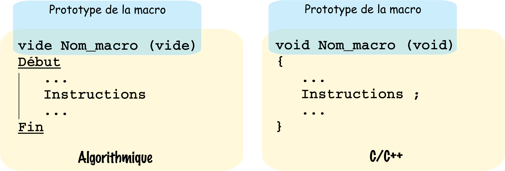
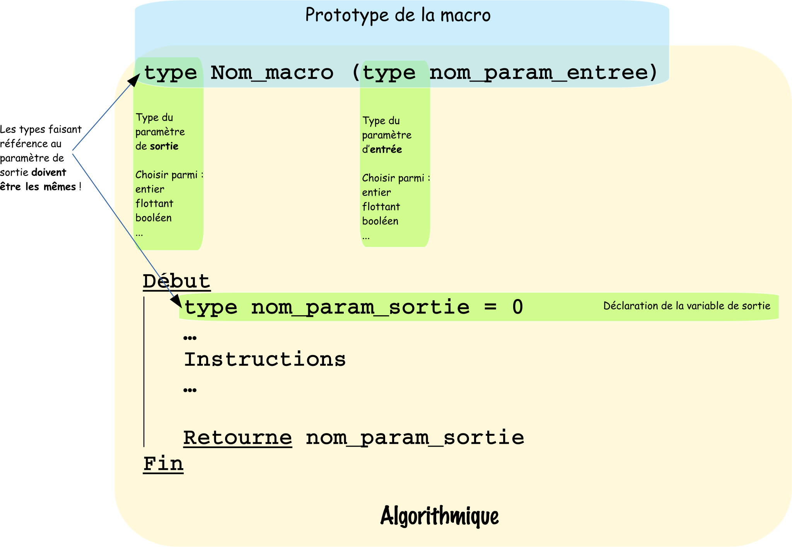

# Création d'une macro ou sous-programme en environnement C/C++

Une macro aussi appelée sous-programme ou fonction est une suite d'instructions définies à l'avance, pouvant être exécutées à l'infini. Une macro est utilisée pour, par exemple simplifier le code en limitant les répétitions.

## 1. Où déclarer sa macro ?

Les déclarations de macros doivent être faites juste après les déclarations de variables globales, dans un code Arduino, comme le montre l'exemple ci-dessous.

```c++
/**************************************************************************************************
Nom ......... : Projet_Alarme_Emission_433.ino
Role ........ : Transmet en 433MHz grâce à la bibliothèque VirtualWire une chaîne de
                caractère sur la pin 12 de l'Arduino Mega 2560
                * Dans le cas normal envoi :"Repos_capteur_ILS"
                * Dans le cas d'un front montant sur CapteurPin envoi : "Alerte_capteur_ILS"
Auteur ...... : J.Serrand
Mail ........ : joris.serrand@rascol.net
Version ..... : V0.0 du 17/02/16
Licence ..... : Copyright (C) 2016  Joris SERRAND

                This program is free software: you can redistribute it and/or modify
                it under the terms of the GNU General Public License as published by
                the Free Software Foundation, either version 3 of the License, or
                (at your option) any later version.

                This program is distributed in the hope that it will be useful,
                but WITHOUT ANY WARRANTY; without even the implied warranty of
                MERCHANTABILITY or FITNESS FOR A PARTICULAR PURPOSE.  See the
                GNU General Public License for more details.

                You should have received a copy of the GNU General Public License
                along with this program.  If not, see <http://www.gnu.org/licenses/>

Compilation . : Avec l'IDE Arduino
****************************************************************************************************/

//Ajout de bibliothèques
#include <Wire.h> //Insertion de la bibliothèque pour les fonctions I2C

//Déclarations de constantes
#define bp 10 //Déclaration d'une constante appelée bp de valeur 10
const float pi=3.14; //Déclaration d'une constante de type float et de nom "pi" initialisée à 3.14

//Déclaration de variables
int cpt = 0; //Déclaration d'un entier de nom "cpt" initialisé à 0
float vitesse = 10.5; //Déclaration d'un flottant de nom "vitesse" initialisé à 10.5

//Déclaration de macros
int ma_macro(float toto)
{
  //Instructions
}

void setup()
{
  //Initialisations
}

void loop()
{
  //Programme principal
}

```

## 2. Comment créer une macro ?

### 2.1 Création d'une macro sans paramètres d'entrée ni de sortie

La figure ci-dessous montre l'exemple de la déclaration d'une telle macro, de manière algorithmique, puis en langage C/C++ :


Ci-dessous l'exemple des macros ```allumer_led_13()``` et ```eteindre_led_13()```, qui respectivement allume et éteint la led 13 lorsque on les appelle dans le programme principal ```loop``` :

```c++
//Déclaration de macros

void allumer_led_13(void)//Déclaration d'une macro sans paramètre d'entrée ni de sortie
{
  digitalWrite(13,HIGH); //Allumage de la led 13
}


void eteindre_led_13(void)//Déclaration d'une macro sans paramètre d'entrée ni de sortie
{
  digitalWrite(13,LOW); //Extinction de la led 13
}

//Initialisations
void setup()
{
  pinMode(13,OUTPUT); //Paramétrage de la pin 13 en sortie
}

//Programme principal
void loop()
{
  allumer_led_13(); //Appel de la macro allumer_led_13()
  delay(1000);
  eteindre_led_13(); //Appel de la macro eteindre_led_13()
  delay(1000);
}
```

### 2.2 Création d'une macro avec paramètre d'entrée

La figure ci-dessous montre l'exemple de la déclaration d'une telle macro, de manière algorithmique, puis en langage C/C++ :


Ci dessous nous donnons un exemple d'utilisation d'une telle macro : ```affichage_mess_serial(boolean presence)```, permet d'envoyer sur le serial le message : ```"Presence d eau"``` quand le paramètre d'entrée ```presence``` vaut ```1``` et ```"Capteur hors d eau"``` quand le paramètre vaut ```0```.


```c++
//Déclaration de macros
void affichage_mess_serial(boolean presence) //Prototype de la macro
{
  if(presence)
    Serial.println("Presence d eau"); //Si le paramètre d’entrée "presence" vaut 1 affichage de "Presence d eau"
  else
    Serial.println("Capteur hors d eau"); //Si le paramètre d’entrée "presence" vaut 0 affichage de "Capteur hors d eau"
}

//Initialisations
void setup()
{
  Serial.begin(9600); //Initialisation du port série à 9600 bauds
}

//Programme principal
void loop()
{
  affichage_mess_serial(0); //Appel de la macro avec le paramètre d'entrée à 0, aura pour effet d'envoyer sur le serial le message : "Capteur hors d eau"

}
```


### 2.3 Création d'une macro avec paramètres d'entrée et de sortie

La figure ci-dessous montre l'exemple de la déclaration d'une telle macro, de manière algorithmique, puis en langage C/C++ :




Ci-dessous la macro ```float hypotenuse(float a, float b)``` renvoi un flottant qui correspond à l’hypoténuse calculée suivant les deux paramètres donnés en entrée, soit les longueurs des deux côtés a et b.

```c++
//Déclaration de macros
float hypotenuse(float a,float b)
{
  float c=0; //Déclaration de la variable c initialisée à 0, qui contiendra le résultat

  c=(pow(a,2)+pow(b,2)); //Calcul de la somme des deux côtés au carré
  c=sqrt(c); //Calcul de la racine carré du résultat précédent

  return c; //Renvoi le contenu de la variable c en paramètre de sortie de la macro  
}

//Initialisations
void setup()
{

}

//Programme principal
void loop()
{
  float hyp=0;
  hyp=hypotenuse(6,8); //Appel de la macro


}
```
