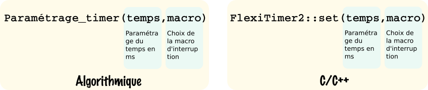

# Utilisation d'un timer

La bibliothèque flexitimer2 permet une utilisation simplifiée du timer du microcontrôleur, nous expliquons ici son fonctionnement.

## 1. La bibliothèque flexitimer2

Un timer permet de programmer l’exécution d'instructions sur une durée donnée. Le paramétrage des timers le l'Atmega2560 fait appel à la programmation de registres complexes, l'utilisation de la bibliothèque flexitimer2 permet de rapidement mettre en place une solution.

Malheureusement cette bibliothèque n'est pas dans la base de données du gestionnaire, **il faut donc l'ajouter manuellement, après l'avoir téléchargée sur le Github du créateur :** [Bibliothèque flexitimer2](https://github.com/wimleers/flexitimer2)

Cliquez sur , puis dans l'IDE Arduino allez dans Croquis > Inclure une bibliothèque > Ajouter la bibliothèque .ZIP


## 2. Paramétrage d'un timer

Le paramétrage du timer peut se faire n'importe où, et plusieurs fois, dans le programme principal ```loop()``` ainsi que dans le ```setup()```. Il faut pour ce faire utiliser la fonction ```FlexiTimer2::set()```, le timer déclenchera une interruption une fois le temps écoulé, il s'agit alors d'indiquer le nom de la macro d'interruption lors de ce paramétrage.



Pour démarrer le timer il suffit d’exécuter la fonction : ```FlexiTimer2::start()``` et pour l'arrêter : ```FlexiTimer2::stop()```

## 3. Utilisation d'un timer

Le programme ci-dessous paramètre le timer pour une durée de 10s et allume la led 13 en fin de comptage de ce dernier :

```c++
#include <FlexiTimer2.h> //Bibliothèque pour utiliser le timer

volatile boolean flag=false; //Déclaration de la variable utilisée dans la macro d'interruption

void macro_interrupt(void)
{
  flag=!flag;
}

void setup()
{
  pinMode(13,OUTPUT);
  FlexiTimer2::set(10000,macro_interrupt); //Paramétrage du timer sur 10s
}

void loop()
{
  FlexiTimer2::start(); //Démarrage du timer

  while(!flag) //Attente de la fin de temporisation, du passage à 1 du flag
  {
    digitalWrite(13,LOW);
  }

  digitalWrite(13,HIGH);
}
```


