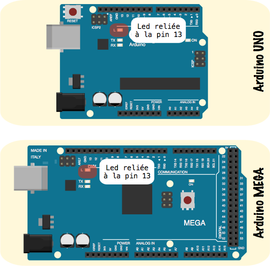

# Découverte des entrées sorties numériques

## Réalisation de l'activité

Pour cela vous devrez **impérativement** utiliser le squelette du programme Arduino donné ci-dessous :

``` c++

 /**************************************************************************************************
 Nom ......... : Clignotement_led_13.ino
 Role ........ : Fait clignoter la led reliée à la pin 13 d'une carte Arduino MEGA
 								 Cycle : 500ms OFF; 500ms ON
 Auteur ...... : Votre nom
 Classe ...... : Votre classe
 Etablissement : Lycée Louis Rascol, Albi, FRANCE <http://louis-rascol.entmip.fr/>
 Mail ........ : Votre_mail@e.rascol.net
 Version ..... : V0.0 du xx/xx/16
 Licence ..... : Copyright (C) 2016  Votre nom

                 This program is free software: you can redistribute it and/or modify
                 it under the terms of the GNU General Public License as published by
                 the Free Software Foundation, either version 3 of the License, or
                 (at your option) any later version.

                 This program is distributed in the hope that it will be useful,
                 but WITHOUT ANY WARRANTY; without even the implied warranty of
                 MERCHANTABILITY or FITNESS FOR A PARTICULAR PURPOSE.  See the
                 GNU General Public License for more details.

                 You should have received a copy of the GNU General Public License
                 along with this program.  If not, see <http://www.gnu.org/licenses/>

 Compilation . : Avec l'IDE Arduino
 ****************************************************************************************************/

 //Ajout de bibliothèques


 //Déclarations de constantes


 //Déclaration de variables


 void setup()
 {
	 //Insérez ici vos paramètres
 }

 void loop()
 {
   //Insérez ici votre programme principal
 }
```

Pour la suite vous pouvez télécharger un fichier zip squelette pré-rempli : [Télécharger](ressources/Squelette_Arduino_Rascol.zip)

**Marche à suivre :**

1. **Faire l'algorithme** du programme en utilisant la notation algorithmique normalisée.
2. Créer un fichier Arduino et y copier-coller le squelette.
3. Codez votre algorithme **ne soyez pas avare en commentaires**.
4. Téléversez sur la carte et **vérifiez le bon fonctionnement**.
5. Appelez le professeur pour valider.

!!! important
    La validation de l'exercice sera uniquement effectuée lors de la présentation d'un **algorithme juste** et d'un **code Arduino suffisamment commenté en fonctionnement**.

## 1. Utilisation des sorties numériques sur une carte Arduino

### 1.1 Clignotement led 13

Nous souhaitons dans un premier temps faire clignoter la led 13 d'une carte Arduino MEGA. La led devra rester allumée **500ms** et éteinte **500ms**.

!!! info
    La led 13 est la led reliée à la pin 13 soudée sur la carte Arduino MEGA ou Arduino UNO comme le montre la figure ci-dessous.



### 1.2 Utilisation du module Grove led


À présent utilisez le programme précédent pour faire clignoter la led d'un module LED Grove relié à la **pin numérique 2**.
Nous utiliserons le même cycle de clignotement que tout à l'heure soit, **500ms éteinte / 500ms allumée**.

## 2. Utilisation des entrées numériques sur une carte Arduino

### 2.1 Bouton poussoir sans condition


Allumer la led du module Grove de la partie 1 lors d'un appui sur le bouton poussoir. La led est toujours reliée à la **pin numérique 2** et le bouton poussoir à la **pin numérique 6**. Dans un premier temps, **ne pas se servir** de la condition ```if()``` ou ```if() else```.

### 2.2 Bouton poussoir avec condition

À présent vous devez faire le même exercice que précédemment mais en utilisant une condition de type ```if()``` ou ```if() else```. Nous utiliserons les mêmes pins.

### 2.3 Allumage inversé

Cette fois-ci il s'agit d'allumer la led quand le bouton poussoir est relâché et de l'éteindre quand on appui sur celui-ci. Nous utiliserons les mêmes pins.

### 2.4 Allumage et extinction explicites

Pour finir, un appui sur le bouton poussoir allumera la led et la laissera allumée, un autre appui éteindra la led et la laissera éteinte.
