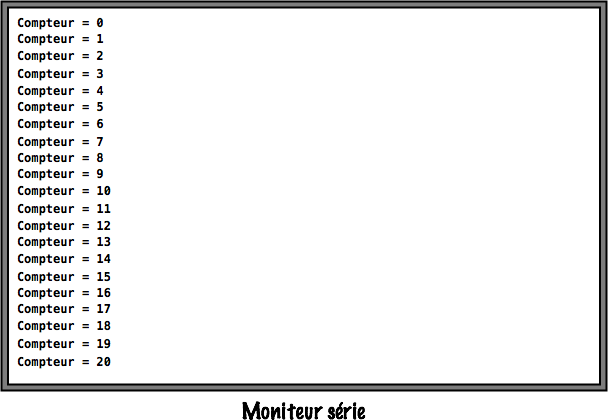
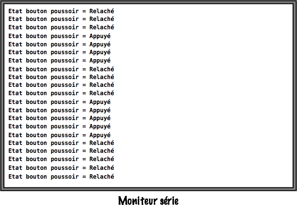

# Exploitation du port série

## Réalisation de l'activité

Pour cela vous devrez **impérativement** utiliser le squelette du programme Arduino donné ci-dessous :

``` c++

 /**************************************************************************************************
 Nom ......... : Clignotement_led_13.ino
 Role ........ : Fait clignoter la led reliée à la pin 13 d'une carte Arduino MEGA
 								 Cycle : 500ms OFF; 500ms ON
 Auteur ...... : Votre nom
 Classe ...... : Votre classe
 Etablissement : Lycée Louis Rascol, Albi, FRANCE <http://louis-rascol.entmip.fr/>
 Mail ........ : Votre_mail@e.rascol.net
 Version ..... : V0.0 du xx/xx/16
 Licence ..... : Copyright (C) 2016  Votre nom

                 This program is free software: you can redistribute it and/or modify
                 it under the terms of the GNU General Public License as published by
                 the Free Software Foundation, either version 3 of the License, or
                 (at your option) any later version.

                 This program is distributed in the hope that it will be useful,
                 but WITHOUT ANY WARRANTY; without even the implied warranty of
                 MERCHANTABILITY or FITNESS FOR A PARTICULAR PURPOSE.  See the
                 GNU General Public License for more details.

                 You should have received a copy of the GNU General Public License
                 along with this program.  If not, see <http://www.gnu.org/licenses/>

 Compilation . : Avec l'IDE Arduino
 ****************************************************************************************************/

 //Ajout de bibliothèques


 //Déclarations de constantes


 //Déclaration de variables


 void setup()
 {
	 //Insérez ici vos paramètres
 }

 void loop()
 {
   //Insérez ici votre programme principal
 }
```

Pour la suite vous pouvez télécharger un fichier zip squelette pré-rempli : [Télécharger](ressources/Squelette_Arduino_Rascol.zip)

**Marche à suivre :**

1. **Faire l'algorithme** du programme en utilisant la notation algorithmique normalisée.
2. Créer un fichier Arduino et y copier-coller le squelette.
3. Codez votre algorithme **ne soyez pas avare en commentaires**.
4. Téléversez sur la carte et **vérifiez le bon fonctionnement**.
5. Appelez le professeur pour valider.

!!! important
    La validation de l'exercice sera uniquement effectuée lors de la présentation d'un **algorithme juste** et d'un **code Arduino suffisamment commenté en fonctionnement**.

## 1. Transmission puis affichage d'un texte sur le moniteur série

Nous souhaitons utiliser le Serial (aussi appelé UART) d'une carte Arduino MEGA pour afficher le texte suivant :```STI2D SIN Rascol, Arduino du basique au complexe.``` Un **retour à la ligne** sera effectué à la fin de la phrase et le texte devra **s'afficher en boucle** comme le montre l'image ci-dessous :


## 2. Incrémentation d'un compteur et affichage sur le moniteur série

Créez un compteur qui démarre à zero et s'incrémente de 1 à chaque passage dans la boucle principale ```void loop()```, affichez l'état de ce compteur à chaque passage grâce au moniteur série, comme le montre l'exemple ci-dessous :



## 3. Affichage de l'état d'un bouton poussoir sur le moniteur série

Pour finir, nous souhaitons afficher l'état d'un bouton poussoir Grove sur le moniteur série. Quand le bouton poussoir est relaché vous devez afficher : ```Etat bouton poussoir = Relaché```, quand ce dernier est appuyé affichez : ```Etat bouton poussoir = Appuyé```. L'exemple ci-dessous montre le comportement attendu :


