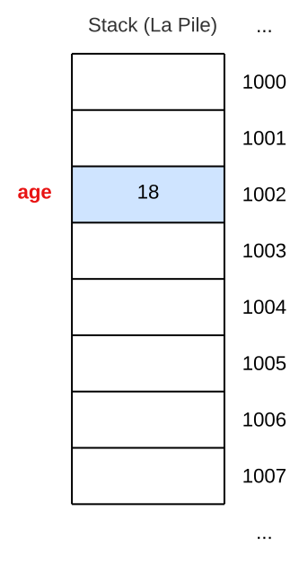

---
search:
  exclude: true
marp: true
style: |
  .columns {
    display: grid;
    grid-template-columns: repeat(2, minmax(0, 1fr));
    gap: 1rem;
  },
  img[alt~="center"] {
  display: block;
  margin: 0 auto;
  }
---
<!-- _backgroundImage: url("assets/bgImage.jpg") -->
# ▶︎ C03 - Variables et Constantes
>## Programmation C++
>### BTS CIEL 1ere année
>### Lycée Louis Rascol, Albi
<br><br>
`Release : v1.0 (11.09.23)`
📧 [joris.serrand@rascol.net](mailto:joris.serrand@rascol.net)
🐙 [Github : ciel-ir-rascol/cpp-cours ](https://github.com/ciel-ir-rascol/cpp-cours)


---
<!-- paginate: true --->
<!--
header: ▶︎ C03 - Variables et Constantes
footer: Programmation C++ • Lycée Louis Rascol, Albi
-->
# Qu'est ce qu'une variable ?
- Une variable est stockée dans la **RAM** (Random Access Memory)
- La mémoire est divisée en cellules, chaque cellule contient **8bits** a une **adresse unique**.

Sans variable on devrait spécifier tout le temps les adresses en mémoire : 

*Pseudo code :*
```text
déplacer 18 dans la case d'adresse 1002
```


---

# Qu'est ce qu'une variable ?

- Grâce au *binding* (liaison) il inutile de retenir l'adresse de la case mémoire, le compilateur s'occupe de tout
- Un nom est associé à une adresse en mémoire, dans notre cas `age` est associé à la case `1002`

On utilisera donc ce genre d'expressions :

*Pseudo code :*
```text
déplacer 18 dans age
```


---

# Qu'est ce qu'une variable ?

- Une variable est une abstraction pour une place en mémoire.
- Ça permet aux programmeurs  d'**utiliser des noms avec du sens** et non une adresse.
- Les variables ont :
  - **Un type : leur catégorie** (Entier, Nombre Réel, Chaîne de caractère ...)
  - **Une valeur : leur contenu** (42, 1.1618, "Hubert")
- **La valeur d'une variable peut changer**
- **Les variables doivent être déclarées avant d'être utilisées**
<div class="columns">
<div>

```cpp
age = 18; 
// 🔴 ERREUR Compilateur
```
</div>
<div>

```cpp
int age; // Déclaration de age
age = 18; // Affectation
```
</div>
</div>

---

# Déclarer une variable
## Syntaxe
```text
Type_Variable Nom_Variable;
```
## Exemples
```cpp
int age;
double taux;
string nom;
```

---

# Règles pour nommer une variable
- Peut contenir des lettres, des nombres et des underscores `_`
- Doit commencer par une lettre
- Interdiction d'utilisée des mots réservés (Mot clés, autres identifiants)
- Interdiction de re-déclarer une variable dans le même scope
  - Une variable déclarée dans une fonction ne peut être redéclarée
## Exemples
```cpp
int test; // 🟢 OK
int 2test; // 🔴 ERREUR Interdiction de commencer un nom par un chiffre
int cout; // 🔴 ERREUR L'identifiant cout est réservé
int test-2; // 🔴 ERREUR '-' non autorisé dans un nom de variable
```

---


---

# Nommage de variables, les bonnes pratiques
- Soyez réguliers avec votre convention de nommage :
  - Camel Case : `maVariable`
  - Snake Case : `ma_variable`
  - ~~Kebab Case et Pascal Case~~ 
- **Commencez par une minuscule** → 1ere lettre majuscule = Classe
- Utiliser des noms qui ont un sens
  ```cpp
  int toto; // ⚠️ À éviter !
  int b; // ⚠️ idem 
  int temperature_frigo; // 👍 nom clair, parfait !
  int temperatureFrigo ; // 👍 idem mais en camelCase
  ```
- Déclarez-les proche de l'endroit ou vous en avec besoin

---

# Initialiser une variable

C++ Propose 3 manières d'initialiser une variable :
```cpp
int age; // ⚠️ age n'est pas initialisée

int age = 18; // Style C initialisation

int age (18); // Initialisation avec constructeur

int age {18}; // 👍 List Initialization (À partir de C++11)
```

‼️ **N'utilisez jamais les variables avant de les avoir initialisées**

---

# Les variables globales
▶︎ Une variable globale peut être utilisée dans **toutes les fonctions** du programme.
Une variable globale se déclare au début du code, **hors de toute fonction**
```cpp
int variableGlobale = 0; // Cette variable peut s'utiliser dans toutes les fonctions

int main(){
  int variableLocale = 0; // Cette variable est utilisable que dans le main
  
  std::cout << variableGlobale << std::endl;
}
```
⚠️ Utilisez les variables globales quand c'est **vraiment  nécessaire**, privilégiez les locales !

---

# Les caractères
Utilisés pour représenter les **caractères** : `'A', 'a', '2' ...`

|Type|Taille|
|---|---|
|`char`| 1 octet = 8 bits|
|`char16_t`| 2 octets = 16 bits|
|`char32_t`| 4 octets = 32 bits|
|`wchar_t`| S'adapte au système d'encodage|

ℹ️ le type `char` est suffisant pour encoder tous les caractères du code ASCII

---


---

# Les entiers
Utilisés pour encoder des **nombres entiers relatifs**
|Type|Taille|Intervalle de valeurs|
|---|---|:---:|
|`short int`| 2 octets | $[-32\ 768 ; 32\ 767]$|
|`int`| 4 octets (arch64) | $[-2\ 147\ 483\ 648 ; 2\ 147\ 483\ 647]$|
|`long int`| 8 octets| $[-9.223\times10^{18};9.223\times10^{18}]$|
|`unsigned short int`| 2 octets|$[0 ;  65\ 535]$|
|`unsigned int`| 4 octets|$[0 ;  4\ 294\ 967\ 295]$|
|`unsigned long int`| 8 octets|$[0;1.8447\times10^{19}]$|

ℹ️ `signed` → Négatif et Positif ; `unsigned` → Uniquement positif

---

# Les réels (nombres à virgule flottante)
Utilisés pour représenter des **nombres à virgule**
|Type|Taille|Précision|Intervalle de valeurs|
|---|---|---|---|
|`float`|4 octets| minimum **6 chiffres** significatifs|$[−3.4028\times10^{38};3.4028\times10^{38}]$ <br> Plus petit positif : $1.4013\times10^{-45}$<br> Plus petit négatif : $-1.4013\times10^{-45}$|
|`double`|8 octets| minimum **10 chiffres** significatifs|$[−1.7977\times10^{308};1.7977\times10^{308}]$<br> Plus petit positif : $4.9407\times10^{-324}$<br> Plus petit négatif : $-4.9407\times10^{-324}$|
|`long double`|10 octets| minimum **10 chiffres** significatifs|$[−1.1897\times10^{4932};1.1897\times10^{4932}]$<br> Plus petit positif : $3.3621\times10^{-4932}$<br> Plus petit négatif : $-3.3621\times10^{-4932}$|

---

# Les Booléens
Utilisés pour représenter **1bit : 0 → `false` ou 1 → `true`**
|Type|Taille|
|---|---|
|`bool`|1 octet|

ℹ️ Bien que la donnée à mémoriser ne soit que d'1 bit, la place en mémoire d'un booléen en C++ est de **1 octet** pour éviter les problèmes d'alignement avec les autres variables.

---

# Exemples de déclarations avec initialisation
 
```cpp
// Déclaration et initialisation d'entiers
int populationFrance {68'042'591};
int populationAlbi {49094};
```
Ici les `'` servent à améliorer la lisibilité d'un grand nombre, ⚠️ **Ce n'est utilisable qu'à partir du C++14.**
```cpp
// Déclaration et initialisation de caractères
char uneLettre {'A'};
char unChiffre {'9'}; // Le caractère '9', pas l'entier !
```
⚠️ Les guillemets doubles sont réservés aux chaines de caractères !

---

# Exemples de déclarations avec initialisation
```cpp
// Déclaration et initialisation de flottants
float soldeCompte {2342.56};
double pibFrance {3.677579e15};
```
Ici le `e` sert à faire une puissance de 10 : `e15` = $10^{15}$

```cpp
// Déclaration et initialisation d'un booléen
bool etatBp {true};
cout << "Etat du Bouton Poussoir : " << etatBp << endl;
// 🖥️ Etat du Bouton Poussoir : 1

bool etatCapteur {false};
cout << "Etat du Capteur : " << etatCapteur << endl;
// 🖥️ Etat du Capteur : 0
```

---

# Gestion des erreurs de dépassement
L'utilisation d'une list initialization `{}` pour une initialisation de variable permet de lever une erreur quand le contenu ne rentre pas dans la variable choisie. Ce que ne fait pas l'opérateur d'affectation style C `=`

```cpp
short int populationFrance = 68'042'591; // Initialisation C Style
cout << populationFrance << endl;
// 🖥️  16223
```
⚠️ La valeur affectée n'est pas correcte, un `short int` ne peut contenir 68 042 591 !

```cpp
short int populationFrance {68'042'591};
cout << populationFrance << endl; // List Initialization
// 🔴 ERROR: constant expression evaluates to 68042591 which cannot be narrowed to type 'short'
```
👍 Le compilateur lève une erreur, il nous prévient que ça ne rentre pas dans la variable.

---

# Connaître la taille d'un type et d'une variable
C++ fournit une fonction appelée `sizeof()` permettant de connaitre la taille d'une variable ou d'un type :
```cpp
cout << sizeof(int) << endl;
// 🖥️ 4
```
La fonction nous indique que sur ma machine un entier fait **4 octets**
```cpp
double valeur{0};
cout << sizeof(valeur) << endl;
// 🖥️ 8
```
La fonction nous indique que sur ma machine la variable `valeur` fait **8 octets**

---

# Connaître les limites et la précision

C++ dans la bibliothèque `climits` fournit les constantes : `INT_MIN`, `INT_MAX`, `CHAR_MIN`...
Pour les flottants c'est la bibliothèque `cfloat` qu'il faut inclure : 
```cpp
#include <iostream>
#include <climits> // Inclusion bibliothèque climits
#include <cfloat> // Inclusion bibliothèque cfloat
using namespace std;

int main() {
    cout << INT_MIN << endl; // 🖥️ -2147483648
    cout << FLT_DIG << endl; // 🖥️ 6
    return 0;
}
```
Liens vers une liste  de toutes les constantes disponibles : [climits](https://cplusplus.com/reference/climits/) et [cfloat](https://cplusplus.com/reference/cfloat/)

---

# Qu'est ce qu'une constante ?
Comme les variables les constantes :

- Ont un nom
- Occupe un espace en mémoire
- Sont typées

Mais, **leurs valeurs ne peuvent pas changer durant l'exécution du programme  !**

---

# Déclarer une constante 
Utilisation du mot clé `const` :
```cpp
const double pi {3.1415926};

const int moisAnnee {12};

pi = 3.1415926; // 🔴 ERREUR du compilateur !
```
