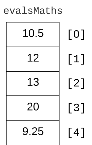

---
search:
  exclude: true
marp: true
style: |
  .columns {
    display: grid;
    grid-template-columns: repeat(2, minmax(0, 1fr));
    gap: 1rem;
  },
  img[alt~="center"] {
  display: block;
  margin: 0 auto;
  },
  section.lead h1 {
  text-align: center;
  font-size: 250%
  }
---
<!-- _backgroundImage: url("assets/bgImage.jpg") -->
# ▶︎ C04 - Tableaux et vecteurs
>## Programmation C++
>### BTS CIEL Informatique et Réseaux
>### Lycée Louis Rascol, Albi
<br><br>
`Release : v1.0 (23.09.23)`
📧 [joris.serrand@rascol.net](mailto:joris.serrand@rascol.net)
🐙 [Github : ciel-ir-rascol/cpp-cours ](https://github.com/ciel-ir-rascol/cpp-cours)


---

<!-- paginate: true --->
<!--
header: ▶︎ C03 - Variables et Constantes
footer: Programmation C++ • Lycée Louis Rascol, Albi
-->
# Qu'est ce qu'un tableau en C++ ?
- Un type de donnée composé ou structure de données
  - C'est une collection d'éléments
  - Tous les éléments sont du même type
- On peut accéder à chaque élément directement

---

# Mais pourquoi aurions nous besoin d'un tableau ?
## Exemple d'un stockage de notes

Nous souhaitons stocker en mémoire les notes de 5 évaluations de Maths, sans tableau on devrait faire :

```cpp
float evalMaths1{10.5};
float evalMaths2{12};
float evalMaths3{13};
float evalMaths4{20};
float evalMaths5{9.25};
```
Imaginez la gestion des notes pour 10, voir 100 variables, ça peut vite devenir fastidieux 🤯

---

<!-- _class: lead -->
# - Les tableaux statiques -
# *Arrays*

---

# Caractéristiques d'un tableau statique
- Sa taille est **fixe**
- Ses éléments sont tous du même type
- Il est stocké de manière continue en mémoire
- Ses éléments peuvent être accessibles par leur index
- Le premier élément est à l'index **0**, le dernier à **taille-1**
- **‼️ Pas de contrôle de dépassement**
- **‼️ Toujours penser à initialiser un tableau**


---

# Déclarer un tableau statique
▶︎ **Syntaxe**
```cpp
type_des_elements nom_tableau [nombre_elements];
```
▶︎ **Exemples**
```cpp
float evalsMaths [5]; // Déclaration d'un tableau de 5 réels

const int nbJoursAn {365}; // Déclaration d'une constante entière
double hautesTemps [nbJoursAn]; // Déclaration d'un tableau de réels de 365 cases

// ⛔ À NE PAS FAIRE !
int nbJoursSemaine {7}; // Déclaration d'une variable 
int nbTachesJour [nbJoursSemaine]; // 🔴 ERREUR on initialise pas un tab avec une var
```

---

# Initialiser un tableau statique
▶︎ **Syntaxe**
```cpp
type_des_elements nom_tableau [nombre_elements] {liste_init};
```
▶︎ **Exemples**
```cpp
// Initialisation des 5 cases
float notesEvals [5] {10.5,12,13,20,9.25};

// Initialisation des 365 cases à 0
int hautesTemps [365] {0};

// Taille du tableau en fonction de l'initialisation , ici 4 cases
int unDernierTableau [] {1,2,3,4};
```

---

# Accès aux éléments d'un tableau statique
▶︎ **Syntaxe**
```cpp
nom_du_tableau [index_de_l_element]
```
▶︎ **Exemples**
```cpp
float notesEvals [5] {10.5,12,13,20,9.25};

cout << "Première note à l'index 0 : "<< notes[0] << endl;
// 🖥️ Première note à l'index 0 : 10.5
cout << "Deuxième note à l'index 1 : "<< notes[1] << endl;
// 🖥️ Deuxième note à l'index 1 : 12
cout << "Dernière note à l'index 4 : "<< notes[4] << endl;
// 🖥️ Dernière note à l'index 4 : 9.25
```

---

# Modification des éléments d'un tableau statique
▶︎ **Syntaxe**
```cpp
nom_du_tableau [index_de_l_element] = valeur_a_assigner;
```
▶︎ **Exemples**
```cpp
float notesEvals [5] {10.5,12,13,20,9.25};

cout << " 3eme note : " << notesEvals [2] << endl;
// 🖥️ 3eme note : 13

// Modification de la 3ème note
notesEvals [2] = 13.25;

cout << " 3eme note : " << notesEvals [2] << endl;
// 🖥️ 3eme note : 13.25
```

---

# Fonctionnement en mémoire
Initialisation d'un tableau de caractères `legume` :
```cpp
char legume [] = {'p','a','t','a','t','e'};
```
Nom du tableau → adresse de la 1ere case :
```cpp
// Opérateur & pour obtenir l'adresse
cout << &legume << endl; // 🖥️ 0x1000
```
‼️ Cases avant et après tableau ≠ 0
```cpp
// On fait un dépassement (overflow)
cout << legume[6] << endl ; // 🖥️ 135
```
ℹ️ Une case mémoire (RAM) vaut **un octet** : 8 bits


---

# Tableaux statiques en 2D
▶︎ **Syntaxe d'un tableau en 2 dimensions**
```cpp
type_des_elements nom_tableau [nombre_lignes] [liste_colonnes];
```
▶︎ **Exemples**
```cpp
int notesFilms [3][4];
```


---

# Tableaux statiques en 2D
▶︎ **Déclaration et initialisation**
```cpp
// Déclaration d'un tableau de 3 lignes 4 colonnes
int notesFilms [3][4] 
{{10,11,12,13},
 {20,21,22,23},
 {30,31,32,33}};

// Déclaration équivalente en une ligne
int notesFilms [3][4] {{10,11,12,13},{20,21,22,23},{30,31,32,33}};
```


---

# Tableaux statiques en 2D
▶︎ **Accès aux cases**
```cpp
int notesFilms [3][4] {{10,11,12,13},{20,21,22,23},{30,31,32,33}};

cout << "Contenu de la case [1][2] : " << notesFilms[1][2] << endl;
// 🖥️ Contenu de la case [1][2] : 22
```


---

<!-- _class: lead -->
# - Les tableaux dynamiques -
# *Vectors*

---
