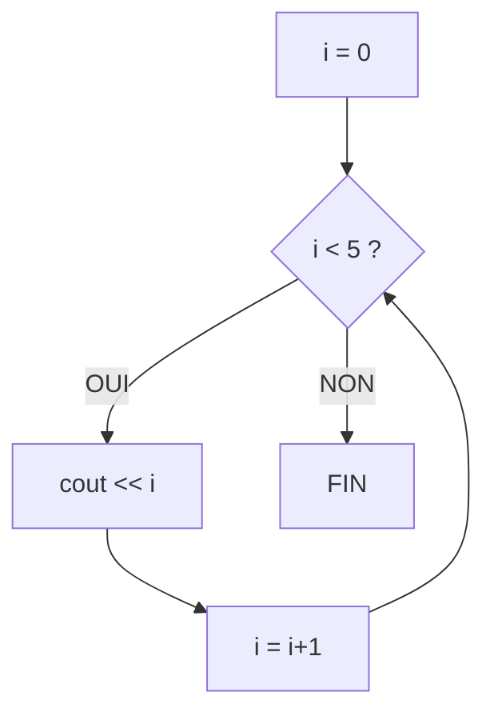
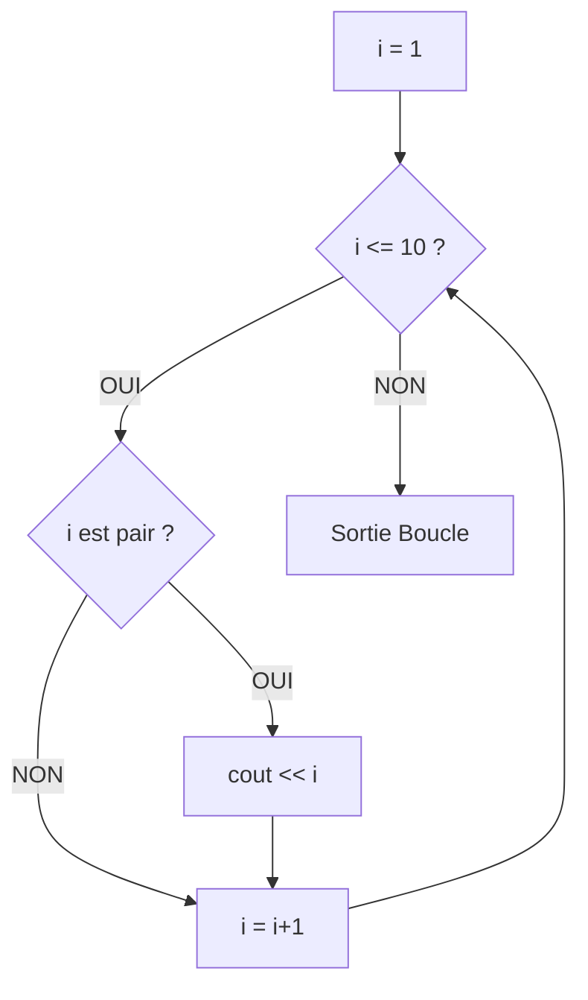
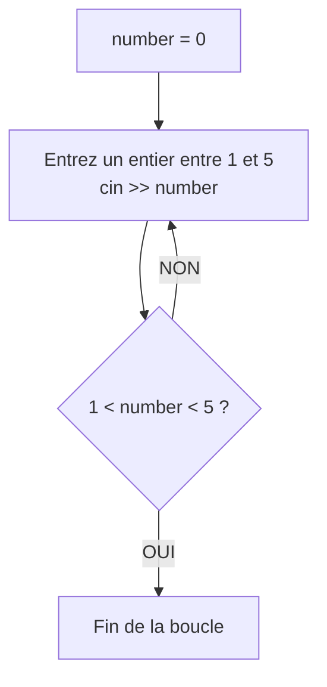

---
search:
    exclude: true
---

# Diagrammes Mermaid du cours
https://mermaid.live/

```mermaid
flowchart TB
    A[i = 0] 
    A--> B{i < 5 ?}
    B -->|OUI| C[cout << i]
    B -->|NON| E[FIN]
    C --> D[i = i+1]
    D --> B
```

```mermaid
flowchart TB
    A[i = 1] 
    A--> B{i <= 10 ?}
    B -->|OUI| C{i est pair ?}
    B -->|NON| F[Sortie Boucle]
    C --> |OUI| D[cout << i]
    C --> |NON| E[i = i+1]
    E --> B
    D --> E
```

```mermaid
flowchart TB
    A[number = 0] 
    A --> B[Entrez un entier entre 1 et 5 \n cin >> number]
    B --> C{1 < number < 5 ?}
    C --> |OUI| D[Fin de la boucle]
    C --> |NON| B
```
  