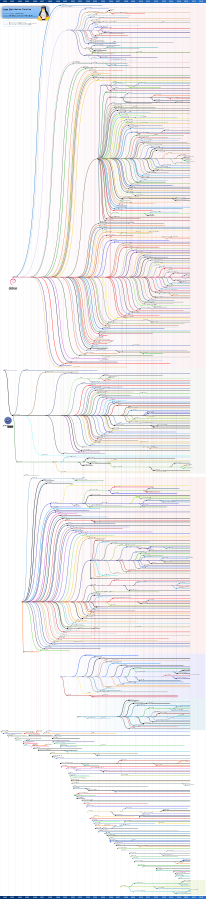

path: tsti2d/linux/01-Intro.md

# Introduction à GNU Linux

<a href="https://fr.wikipedia.org/wiki/Tux">Tux</a> l’emblème de Linux déssiné par Larry Ewing en 1996

## 1- C'est quoi Linux ?

GNU Linux est spécial de part sa différence avec les systèmes d’exploitation dits *classiques* tels que Mac OSX ou Microsoft Windows. Une des principales différences réside dans le côté Open-Source et gratuit de cet OS. En effet Linux nous permet de modifier entièrement la composition du système, pour pouvoir le façonner à notre guise le code source, c'est à dire *la recette de fabrication* est rendu disponible à l’utilisateur, l’utilisation d’un tel système rend alors plus souple la programmation et l’expérimentation.

A savoir Linux est connu pour sa grande portabilité, on peut le retrouver dans des téléphones portables, des machines à laver le linge, des serveurs informatiques, des supercalculateurs, des voitures ou encore des télévisions.

Quelques exemples de systèmes utilisant Linux :

* Les serveurs web : le site Wikipedia est hébergé sur un serveur LAMP (Linux Apache MySQL PHP)
* L'OS Android pour les smartphones
* Les *boxs* internet de Orange, Free, ou SFR
* Les GPS Tomtom

## 2- De GNU à Linux

<a href="http://leozub.livejournal.com/117908.html">"Richard Stallman"</a> by <a href="https://leozub.livejournal.com/">Leonid Dmitriev (leozub)</a> is licensed under <a href="https://creativecommons.org/licenses/by/3.0/">CC BY 3.0</a>

Tout commence avec UNIX dont les origines remontent en 1969, c’est un système qui fonctionne sans interface graphique, en ligne de code, concurrent direct à l’époque du système MS-DOS de Microsoft (sorti en 1984). En 1984 [Richard Stallman](https://fr.wikipedia.org/wiki/Richard_Stallman), chercheur en intelligence artificielle au MIT, créa le projet GNU, soit plus ou moins un système d’exploitation fonctionnant comme UNIX, la seule différence étant qu’UNIX était propriétaire et payant et GNU lui sera libre et gratuit.

<a href="https://commons.wikimedia.org/wiki/File:LinuxCon_Europe_Linus_Torvalds_03.jpg">"Linus Torvalds"</a> by <a href="https://commons.wikimedia.org/wiki/User:Krd">Krd</a> is licensed under <a href="https://creativecommons.org/licenses/by-sa/4.0">CC BY-SA 4.0</a>

Une autre personne va intervenir dans la création de ce nouveau système, c’est Le Finlandais [Linus Torvalds](https://fr.wikipedia.org/wiki/Linus_Torvalds), étudiant à l’université de Helsinki, qui entreprend de créer son propre système d’exploitation, qui a pris son nom (Linus + Unix).Les deux hommes se sont par la suite associés pour créer le système GNU Linux, Richard Stallman créant les programmes de base (programme de copie de fichier, de suppression de
fichier, éditeur de texte), Linus Torvalds se lançant dans la création du « cœur » du système d'exploitation : le noyau. Le projet GNU (programmes libres) et Linux (noyau d'OS) ont fusionné pour créer GNU/Linux.

## 3- Les distributions de Linux

Une distribution est en quelque sorte l’emballage de Linux, le coeur du système GNU Linux, restant le même pour toutes. Linux est un système d’exploitation très complet, avec de nombreux logiciels disponibles, les distributions ont été créées pour permette à l’utilisateur d’avoir un système correspondant à l’utilisation qu’il fait de sa machine. Toutes les distributions sont compatibles les unes avec les autres, la seule différence étant la prise en main.

Parmi les choses variant d’une distribution à une autre, on peut citer :

* **L'installation** : elle peut être très simplifiée comme très compliquée.
* **La gestion de l'installation des programmes** : Si elle est bien faite et centralisée, elle peut rendre l'installation de
nouveaux logiciels plus simple que sous Windows.
* Les programmes pré-installés sur l’ordinateur.

Il existe plusieurs centaines de distributions Linux, certaines étant des forks (copies adaptées) de distributions principales, le site internet [DistroWatch.com](https://distrowatch.com), les recense pratiquement de manière exhaustive. Nous pouvons trouver sur wikipédia une timeline sous forme d'arbre généalogique des distributions, régulièrement mis à jour :

[Le lien de l'image pour la visualiser en grand](https://upload.wikimedia.org/wikipedia/commons/1/1b/Linux_Distribution_Timeline.svg)

Nous donnons ci-dessous le descriptif des principales distributions trouvées en débuts de branches de la timeline précédente :

| Distributions| Année de création | Description  |
|---|---|---|
|  | 1993 |C’est une des seules distributions qui soit gérée par des développeurs indépendants plutôt que par une entreprise. C'est une des distributions les plus populaires. La distribution qui équipe le Raspberry Pi, à savoir Raspbian est une sous-distribution de Debian. La distribution Ubuntu que nous utiliserons pour les séances de TP l’est de même.|
|  | 1995 | Editée par une entreprise américaine, cette distribution propriétaire est célèbre et très répandue, notamment sur les serveurs. Fedora est une sous distribution de Red Hat, très utilisée dans le milieu universitaire.|
|  | 1992 | Une distribution célèbre Allemande, soutenue par l’entreprise Novell. |
|  | 1993 | Une des plus anciennes distributions de Linux, qui existe encore aujourd’hui.|
